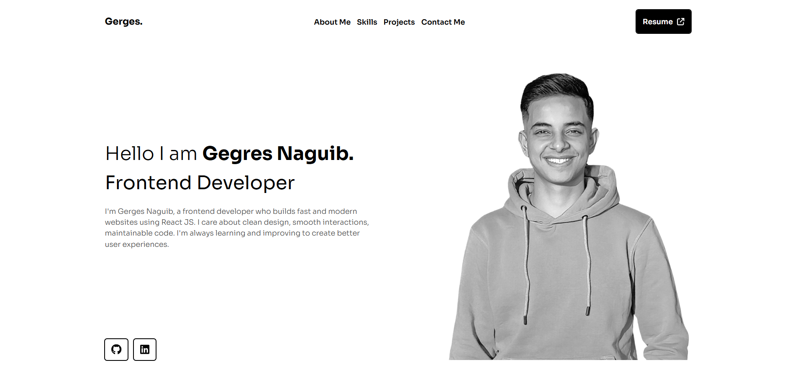

#  Gerges' Personal Portfolio

Welcome to my personal portfolio website — a showcase of my skills, projects, and passion for front-end development using modern web technologies.

---

##  Live Demo

 [gerges-portfolio.vercel.app](https://gerges-portfolio.vercel.app)

---

##  Tech Stack

- **Vite** + **React.js**
- **React Router DOM**
- **Tailwind CSS**
- **Font Awesome**
- **Google Fonts**
- **Responsive Design**

---

##  Features

- Fully responsive and mobile-friendly layout  
- Smooth scroll navigation with sticky navbar  
- Light/dark theme-ready design structure  
- Modern, minimal UI inspired by design best practices  
- Projects section powered by dynamic data  
- Downloadable resume and social media links  
- Contact form (FormSubmit integration)

---

##  Pages & Sections

- **Hero Section** — Catchy introduction + call to action  
- **About Me** — Short bio with purpose  
- **Skills** — Tech stack shown using cards and icons  
- **Projects** — Real apps with live preview and descriptions  
- **Contact** — Functional form + social links  
- **Footer** — Clean, minimalist footer with scroll-to-top

---

## Contact

If you'd like to get in touch:

-  **Email:** gerges7001@gmail.com  
-  [LinkedIn](https://www.linkedin.com/in/gerges-naguib-319987218/)  
-  [GitHub](https://github.com/Gerges-GN)  
-  E-mail: gerges.naguib.dev@gmail.com
